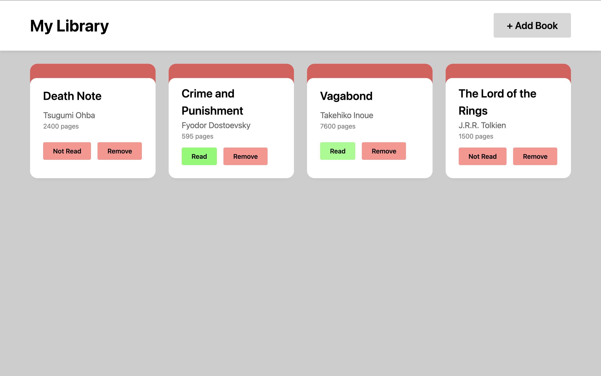

# library

#### Check the live demo here -> https://amormio25.github.io/library/

## Features 
- Includes a dialog component for adding new books, ensuring a seamless user experience
- Dynamic interface displaying books with real-time updates
- Responsive design ensuring usability across devices

## Acknowledgements
- Project by The Odin Project
- Inspired by project submissions to The Odin Project